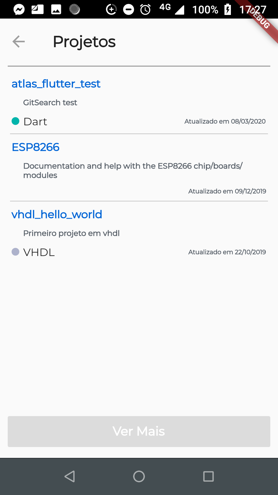

# GitSearch feito em Flutter 
 
Este projeto foi realizado para um teste.

 
Seu objetivo é fazer busca de usuários do GitHub, para então visualizar seus projetos.

 
 
 First Header | Second Header
------------ | -------------
Content from cell 1 | Content from cell 2
Content in the first column | Content in the second column
 
 
Screenshots

    
